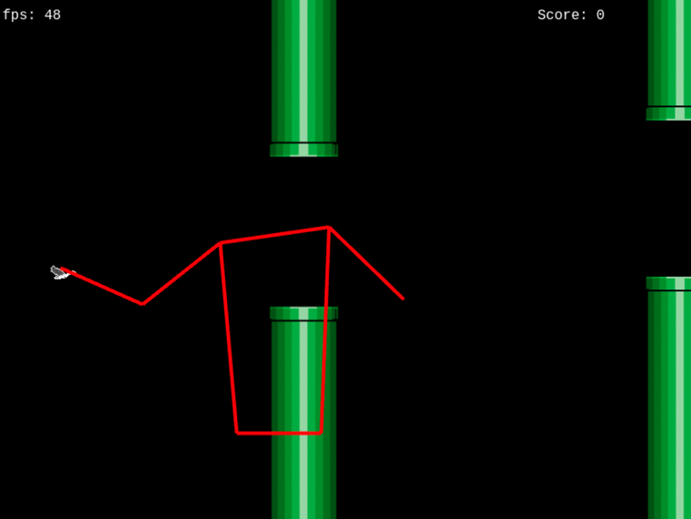

# KIBirdy

A prototype game control like Flappy Bird controlled with you body via webcam.

Uses the webcam with googles posenet to identify your arms do a bird wing flap,
by checking if your wrists are above or below you shoulds.
With every flap the bird gains height and you can pass the pipes... you know flappy bird.

## DEMO

[Github Pages hosted DEMO](https://derandreas-dt.github.io/phaser-posenet-flappybird/)

This little demo is hosted on GitHub Pages and served from the dist folder.
So should be latest build with the newest bugs :)

## Images and Howto

## Mentions

  * based on the phaser template by Yandeu [Github Link](https://github.com/yandeu/phaser-project-template)
  * uses tensorflow posenet [GitHub Link](https://github.com/tensorflow/tfjs-models/tree/master/posenet)
  * game logic based on [Emanuele Feronato Blog Series](https://www.emanueleferonato.com/tag/flappy-bird/)
  * Hit Sound used from [OpenGameArt](https://opengameart.org/content/37-hitspunches)

## License

MIT License
